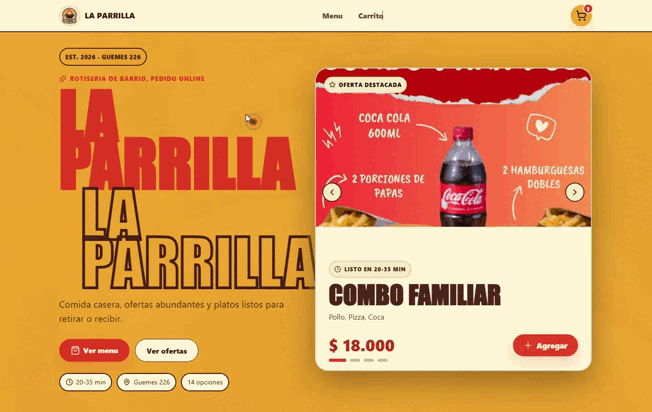
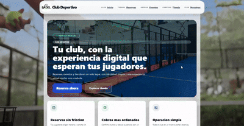
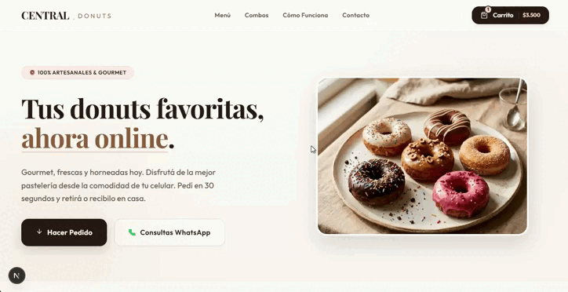
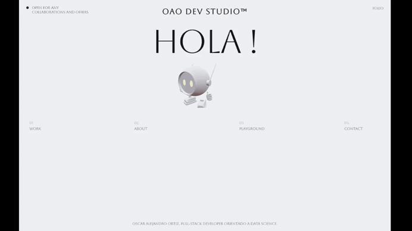
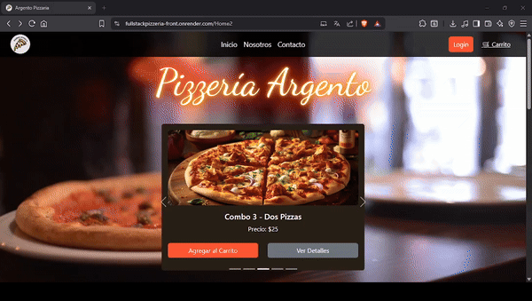

# Oscar Alejandro Ortiz

**Full Stack Developer con experiencia en SaaS, reservas online, e-commerce y sistemas para negocios.**

---

## Sobre mí

Soy desarrollador full stack enfocado en crear aplicaciones web reales para negocios: plataformas SaaS, sistemas multi-tenant, reservas online, e-commerce, POS, inventario, dashboards administrativos e integraciones de pago.

Trabajo principalmente con **Next.js, React, Node.js, TypeScript, PostgreSQL, SQLite/libSQL, Prisma, Drizzle y Mercado Pago**, priorizando arquitectura simple, datos bien modelados y flujos útiles para operación diaria.

También desarrollo experiencias visuales con **Three.js y React Three Fiber**, pero como diferencial complementario dentro de productos web modernos.

---

## Experiencia profesional

- SaaS B2B y arquitectura multi-tenant.
- Sistemas de reservas para servicios, barberías y clubes deportivos.
- E-commerce con carrito, checkout, panel administrativo y pagos.
- POS, inventario, reportes, tickets PDF y códigos de barra.
- Dashboards administrativos para gestión operativa.
- Integraciones con Mercado Pago, WhatsApp, Vercel, Turso/libSQL y PostgreSQL.
- Frontend moderno, mobile-first y experiencias 3D como valor visual secundario.

---

## Stack principal

| Área | Tecnologías |
|---|---|
| Frontend | Next.js, React, TypeScript, JavaScript, Tailwind CSS, Vite |
| Backend | Node.js, Express, API Routes, REST, servicios y repositorios |
| Bases de datos | PostgreSQL, SQLite, Turso/libSQL, Prisma, Drizzle |
| Pagos / Integraciones | Mercado Pago, webhooks, WhatsApp, Formspree |
| Deploy / DevOps | Vercel, Render, Docker, Docker Compose, scripts de migración y seed |
| UI / Experiencias 3D | Three.js, React Three Fiber, Drei, GSAP, Framer Motion |

---

## Proyectos destacados

| Proyecto | Tipo | Stack | Qué resuelve | Link |
|---|---|---|---|---|
| **Barberia / Dibok**   | SaaS multi-tenant de reservas | Next.js, TypeScript, Turso/libSQL, PostgreSQL, Mercado Pago | Plataforma para barberías y servicios con tenants, dominios/slug, agenda, disponibilidad, turnos, panel owner, pagos por tenant y webhooks. | [Barberia](https://github.com/OAODesarrollador/Barberia) / [Página web](https://dibok.app) |
| **Rotiseria**   | E-commerce gastronómico | Next.js, React, Turso/libSQL, Drizzle, Mercado Pago, Vercel | Catálogo público con carrito, checkout, retiro/envío, pagos con Mercado Pago, webhook, gestión de pedidos y panel admin. | [Repositorio](https://github.com/OAODesarrollador/Rotiseria) / [Página web-Demo](https://rotiseria-prueba.vercel.app/) |
| **TiendaSaludable**   | POS e inventario | React, Node.js, JavaScript, backend/frontend separados | Punto de venta para tienda de productos naturales con escaneo EAN-13, generación de códigos de barra, CRUD de productos, tickets PDF y reportes con gráficos. | [Repositorio](https://github.com/OAODesarrollador/TiendaSaludable) |
| **PadelClub**   | Reservas de canchas | React, Node.js, Docker, Prisma, SQLite/PostgreSQL | Sistema instalable para clubes de pádel con reservas públicas, confirmación, gestión por token, panel admin, backups, Swagger y modo portable/offline-first. | [Repositorio](https://github.com/OAODesarrollador/PadelClub) / [Demo](https://club-deportivo.playturno.online/) / [Página web](https://playturno.online) / [Página informativa](https://sinnombre.playturno.online) |
| **Donnas**   | Tienda boutique mobile-first | Next.js, React, TypeScript, Prisma, PostgreSQL, Framer Motion | Landing y e-commerce boutique para gastronomía/donuts con catálogo, filtros, carrito responsive, checkout y diseño optimizado para tráfico desde Instagram. | [Repositorio](https://github.com/OAODesarrollador/Donnas) |
| **Portfolio**   | Portfolio 3D interactivo | React, Vite, Three.js, React Three Fiber, Drei, GSAP | Portfolio inmersivo con escenas 3D, animaciones, routing, manejo de fallback para assets 3D y foco en performance visual. | [Repositorio](https://github.com/OAODesarrollador/Portfolio) / [Demo](https://portfolio-oaodevstudio.vercel.app/) |
| **FullStackPizzeria**   | E-commerce y gestión de pedidos | TypeScript, React, Node.js, Express, PostgreSQL, Prisma | Sistema de pedidos de pizzería con carrito, roles operativos, seguimiento de entregas y despliegue en Render. | [Repositorio](https://github.com/OAODesarrollador/FullStackPizzeria) |

---

## Qué resuelvo

- Convertir procesos manuales de negocios en sistemas web administrables.
- Diseñar modelos de datos para operación multi-tenant y paneles internos.
- Implementar flujos completos: catálogo, carrito, reserva, pago, webhook, estado y administración.
- Preparar aplicaciones para deploy real con variables de entorno, seeds, migraciones y documentación.
- Construir interfaces claras para usuarios finales y operadores administrativos.

---

## GitHub Insights

---

## Contacto

- Email: [oaodesarrollador@gmail.com](mailto:oaodesarrollador@gmail.com)
- LinkedIn: [Oscar Alejandro Ortiz](https://www.linkedin.com/in/oscar-alejandro-ortiz-programadorpython/)
- GitHub: [OAODesarrollador](https://github.com/OAODesarrollador)

---

**Disponible para proyectos y oportunidades como Full Stack Developer.**

